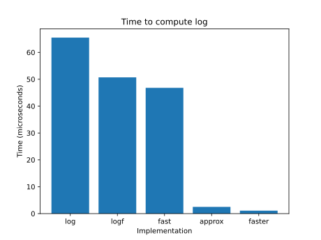

# benchmark-elementary-functions

This repository aims to test the performance and accuracy of different elementary functions (e.g. log, sin, cos...).

## Logarithm Results

| Function              | Time (us) | Average Error        | Max Error            |
|-----------------------|-----------|----------------------|----------------------|
| STD DOUBLE            | 65.458    | 0                    | 0                    |
| STD SINGLE            | 50.739    | 1.38617e-08          | 5.86492e-08          |
| FAST LOGF             | 47.7693   | 1.43832e-08          | 7.55761e-08          |
| APPROXIMATE LOGF      | 2.5359    | 5.74123e-06          | 1.49805e-05          |
| FASTER LOGF           | 1.14601   | 0.0125169            | 0.0401875            |

Faster logf is 44 times faster than std::log but is also much less accurate.

As the image shwos:
[Alt text](./controllers_brief.svg)

## SinCos Results

| Function              | Time (ms) | 
|-----------------------|-----------|
| STD SIN COS            | 34.9386   |
| STD SINCOS             | 34.8707   |

It seems that `gcc-11` optimizes two different calls to `sin` and `cos` to the fast function `sincos` that computes both at the same time.
